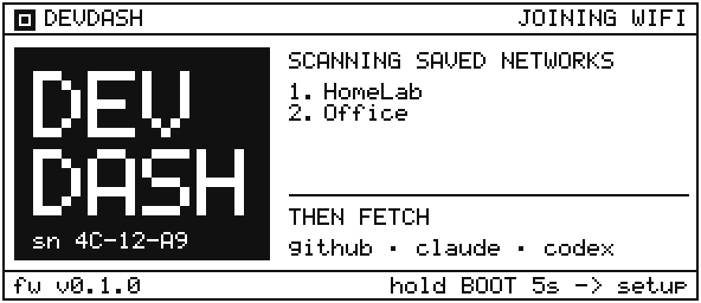
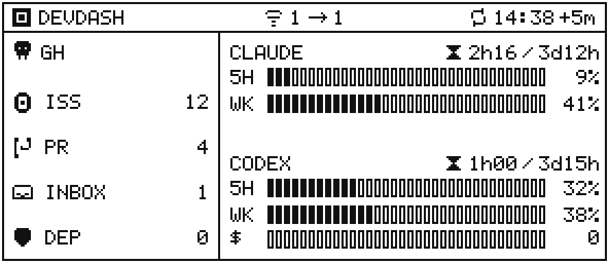
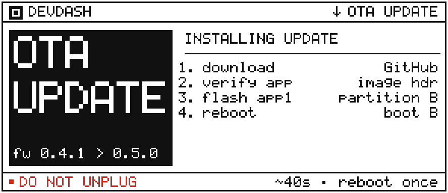

# eink-devdash

A physical developer dashboard on a 2.9" e-ink display, driven by an
ESP32-S3. The reference panel is the WeAct Studio 2.9" SSD1680
Black/White/Red (BWR) module with red alert highlights; the same
firmware binary also supports the Black/White (BW) variant of that module.
The BW panel is recommended for the best day-to-day dashboard experience:
it keeps the UI monochrome, folds red operations to black, and enables
fast per-region partial refreshes. Shows GitHub activity, Claude Code
rate limits, and Codex usage, updated on a configurable interval via deep
sleep.

[](https://github.com/HarmEllis/eink-devdash/actions/workflows/ci.yml)
[](https://github.com/HarmEllis/eink-devdash/pkgs/container/eink-devdash)
[](LICENSE)

| Boot screen | Dashboard | OTA update |
|-------------|-----------|------------|
|  |  |  |

Red ink highlights alerts: Dependabot findings, usage above 80%, or auth
errors.

---

## Contents

- [Hardware](#hardware)
- [Quick start](#quick-start)
- [Configuration](#configuration)
- [Flashing the firmware](#flashing-the-firmware)
- [Provisioning over WiFi](#provisioning-over-wifi)
- [API reference](#api-reference)
- [Architecture](#architecture)
- [Development](#development)
- [Releases](#releases)
- [Technical reference](#technical-reference)
- [License](#license)

---

## Hardware

| Part | Spec |
|------|------|
| MCU | ESP32-S3 Super Mini |
| Display | WeAct 2.9" SSD1680 e-ink (128×296 px) — Black/White/Red (BWR) or Black/White (BW) |
| Driver IC | SSD1680 (SPI) |

Both the BWR and BW variants of the WeAct 2.9" SSD1680 module are supported
from the same firmware binary and the same SPI wiring. On a BW panel the
firmware folds red drawing operations to black at the framebuffer level and
runs a per-region partial-refresh path; on a BWR panel the full-colour refresh
is unchanged.

After flashing, open the captive portal and pick your panel type under
**Display** so the firmware knows which screen you actually have. The choice is
saved on the device and persists across reboots, so you only set it once.

**Panel choice:**

| Panel | Recommended when | Advantages | Tradeoffs |
|-------|------------------|------------|-----------|
| WeAct 2.9" BW | You want the best dashboard experience and faster routine updates. | Fast per-region partial refreshes, fewer full-screen flashes, same wiring and firmware binary. The default cap of 5 partial refreshes per region has not shown visible ghosting in project hardware testing. | No red ink; alert highlights render as black. Ghosting becomes a tuning concern only if the partial cap is raised beyond the default. |
| WeAct 2.9" BWR | You specifically want red alert highlights. | Red ink makes alerts visually distinct and remains the reference/original panel path. | Runtime dashboard updates are full-colour refreshes, so normal changes are slower and cause more full-screen flashes. |

### Wiring

| Display pin | ESP32-S3 GPIO | Color |
|-------------|---------------|-------|
| SDA (MOSI) | 11 | Yellow |
| SCL (SCK) | 12 | Green |
| CS | 10 | Blue |
| D/C | 9 | White |
| RES | 1 | Orange |
| BUSY | 13 | Purple |
| VCC | 3V3 | Red |
| GND | GND | Black |

---

## Quick start

This is the recommended path for normal use: a published Docker image plus
the included web flasher. No build tools required.

### 1. Run the API server

Create a `.env` file next to `docker-compose.yml` (copy `.env.example` and
fill the values described in [Configuration](#configuration)).

Pull the latest published image and start the container:

```bash
docker compose pull
docker compose up -d
```

The API listens on `http://<host>:3000` and advertises
`http://devdash-api.local:3000` over mDNS when the container network allows
multicast.

> **Security:** keep this API on your trusted local network only. The
> firmware talks to it over plain HTTP and sends the bearer token without
> TLS, so do not expose port 3000 to the internet or route it through a
> public reverse proxy. Use the optional Cloudflare relay below when the
> device needs an internet-reachable endpoint.

For reliable `.local` discovery on Linux Docker hosts, use host networking:

```bash
docker compose --profile mdns-host pull
docker compose --profile mdns-host up -d api-mdns-host
```

Pin a specific image version by setting `IMAGE_TAG` in `.env`:

```env
IMAGE_TAG=v0.1.0
```

Verify the API is reachable:

```bash
curl http://<host>:3000/health
# {"ok":true}
```

### 2. Flash the firmware

See [Flashing the firmware](#flashing-the-firmware). Browser-based flashing
is the fastest path; building from source is documented under
[Development](#development).

### 3. Provision

Power up the ESP32-S3, scan the on-screen QR with your phone, fill in WiFi
and the API URL/token in the captive portal. See
[Provisioning over WiFi](#provisioning-over-wifi).

---

## Configuration

Environment variables read by the API container. Set them in `.env` next to
`docker-compose.yml`.

| Variable | Required | Default | Description |
|----------|----------|---------|-------------|
| `DEVICE_TOKEN` | yes | — | Shared secret the firmware sends in `Authorization: Bearer …`. Generate 32+ random characters. |
| `DEVICE_UUID` | relay only | empty | Opaque v4 UUID used as the Cloudflare relay routing key. Required when `RELAY_ENABLED=true`. |
| `CODE_HOST_PROVIDER` | no | auto | Runtime code-host provider: `github`, `gitlab`, or `none`. When unset, the API uses `github` only if `GITHUB_TOKEN` is configured; otherwise it uses `none`. GitLab is reserved in config shape only and does not emit a service yet. |
| `GITHUB_TOKEN` | no | empty | GitHub personal access token for repository counters: issues, pull requests, and Dependabot alerts. Fine-grained PATs need `Dependabot alerts` read permission for DEP; classic PATs need `security_events`. Use `repo` only when private repo issues/PRs must be counted. |
| `GITHUB_NOTIFICATIONS_TOKEN` | no | empty | Classic GitHub personal access token with `notifications` scope for unread notifications. Fine-grained PATs do not support GitHub's notifications API. When empty, the API omits the notifications counter and the firmware hides `INBOX`. |
| `CODEX_PLAN_TYPE` | no | empty | Set to `plus` or `team` when multiple ChatGPT accounts are visible. |
| `CODEX_LIVE_USAGE` | no | `true` | Set to `false` to skip the live Codex app-server probe and read only the on-disk session JSONL. |
| `CODEX_CLI_PATH` | no | empty | Override the Codex CLI binary path. |
| `CODEX_APP_SERVER_TIMEOUT_MS` | no | `8000` | Timeout for the Codex live probe. |
| `HOST_UID` | no | `1000` | UID the container runs as. Set to `$(id -u)` so the API can write `~/.claude/.credentials.json` as the host user that owns it. |
| `HOST_GID` | no | `1000` | GID the container runs as. Set to `$(id -g)`. |
| `CODEX_HOME` | no | `/tmp/devdash-codex-runtime` | Writable Codex runtime home inside the container. Set by `docker-compose.yml`. Lives under `/tmp` so it stays writable for any UID. |
| `CODEX_SOURCE_HOME` | no | `/home/node/.codex-source` | Read-only host Codex home mount used as the source for auth/config sync. Set by `docker-compose.yml`. |
| `CODEX_SESSIONS_DIR` | no | `/home/node/.codex-source/sessions` | Codex session JSONL directory used by the fallback reader. Set by `docker-compose.yml`. |
| `DASHBOARD_TIME_ZONE` | no | `Europe/Amsterdam` | IANA timezone used for the dashboard's local timestamp (`updatedAtLocal` / `updatedAtLocalIso`). The device's per-network quiet hours are evaluated against this local time. Falls back to `TZ`, then `Europe/Amsterdam`. |
| `MDNS_ENABLED` | no | `true` | Set to `false` to disable mDNS advertising. |
| `MDNS_NAME` | no | `devdash-api` | Hostname under `.local`. |
| `OTA_ENABLED` | no | `true` | Set to `false` to make `/ota/manifest` report `{otaEnabled:false}` regardless of `APP_VERSION`. Pins all devices on the network to their installed firmware. |
| `RELAY_ENABLED` | no | `false` | Enables outbound publishing to the Cloudflare relay. LAN `/dashboard` stays available. |
| `RELAY_URL` | relay only | empty | Public Worker base URL, for example `https://devdash-relay.example.workers.dev`. The API converts it to `wss://.../connect?uuid=...`. |
| `RELAY_PUBLISH_KEY` | relay only | empty | Secret used by the API container to authenticate the outbound WebSocket publisher. Set the same value as the Worker secret. |
| `RELAY_PUBLISH_INTERVAL_MS` | no | `300000` | Publish cadence for the relay WebSocket. Defaults to 5 minutes to match the normal device refresh cadence and avoid unnecessary upstream API probes. |
| `RELAY_RECONNECT_MIN_MS` | no | `1000` | Initial reconnect backoff after the relay WebSocket disconnects. |
| `RELAY_RECONNECT_MAX_MS` | no | `60000` | Maximum reconnect backoff after repeated relay disconnects. |
| `IMAGE_TAG` | no | `latest` | Pin the published image to a specific tag (e.g. `v0.1.0`). |

The container mounts `~/.claude` **read-write** and mounts host `~/.codex`
read-only at `/home/node/.codex-source`. The Claude side needs write access
because the API refreshes the OAuth access token in place (surgical edit of
`claudeAiOauth.{accessToken,expiresAt,refreshToken}`, all other fields
untouched, atomic temp-file + rename) so the dashboard stays live while
Claude Code is idle. The Claude CLI keeps working transparently with the
refreshed credentials.

For the refresh path to work, the container must run as the **same UID/GID
as the host user that owns `~/.claude`**. Set `HOST_UID` and `HOST_GID` in
`.env`:

```bash
echo "HOST_UID=$(id -u)" >> .env
echo "HOST_GID=$(id -g)" >> .env
```

`docker-compose.yml` passes these to the container via the `user:`
directive, so the API writes credentials as your own host user — no `chown`
or ACL on `~/.claude` required, and no extra principal gains access. If
`HOST_UID`/`HOST_GID` are unset the container defaults to `1000:1000`,
which only works when your host user happens to be uid `1000`. If the UIDs
don't match the api logs `cannot write to /home/node/.claude` and falls
back to the read-only path; the dashboard still works whenever the on-disk
token is fresh.

Run **either** the default `api` service **or** the host-network
`api-mdns-host` profile, not both at once: the credentials write path is
guarded by a file lock so concurrent api processes won't corrupt the file,
but two services serving the dashboard simultaneously isn't an intended
deployment.

Before each live Codex usage probe, the API syncs auth/config files from
the Codex source into `/tmp/devdash-codex-runtime` (writable for any UID)
used by `codex app-server`. Session JSONL fallback reads directly from
`/home/node/.codex-source/sessions`, so new host sessions are visible
without copying session history into the container. No keys are baked into
the image.

### Optional Cloudflare relay (self-host)

The relay lets the device reach the dashboard from outside your LAN **without**
exposing the Docker API to the internet. It is **self-host only**: you deploy
*your own* Cloudflare Worker, holding only *your own* device. There is no shared
service and no manual "accept device" step, so there is no open-proxy surface to
abuse — the only tenant of your Worker is you.

```text
API container --WSS  /connect?uuid=<DEVICE_UUID>--> your Cloudflare Worker
ESP32         --HTTPS /d/<DEVICE_UUID>/dashboard--> same Worker
```

#### One-command setup

From a clone, with [Node](https://nodejs.org) installed:

```bash
cd relay
npm install
npm run setup
```

`npm run setup` does everything end to end:

1. Ensures `wrangler` is authenticated (runs `wrangler login` once if needed —
   the only interactive step, Cloudflare's own browser OAuth).
2. Generates a fresh identity: `DEVICE_UUID`, `DEVICE_TOKEN`,
   `RELAY_PUBLISH_KEY`, `ADMIN_KEY` (cryptographically random; nothing is typed
   by hand).
3. Deploys the Worker and pushes those secrets (via stdin, never on the command
   line).
4. Merges the generated values into the root `.env` that Docker and the API
   read — `DEVICE_TOKEN`, `DEVICE_UUID`, `RELAY_ENABLED=true`, `RELAY_URL`,
   `RELAY_PUBLISH_KEY`. Existing keys are updated in place; unrelated lines are
   left untouched.
5. Prints the firmware provisioning details — the relay dashboard URL, the
   device token, and **two terminal QR codes** (one per captive-portal field)
   so neither value has to be transcribed by hand.

Then start the publisher and provision the device:

```bash
docker compose up -d
```

Provision the ESP32 by scanning the two QR codes into the captive portal's API
URL and device-token fields. End-to-end this is: **clone → `npm run setup` → one
browser login → `docker compose up -d` → flash + provision**, with no secrets
typed by hand (they are generated, pushed, and shown as scannable QR codes). A
single combined provisioning URL (one scan for both fields) is a planned
firmware-side enhancement.

> Re-running `npm run setup` mints a **new** identity and overwrites the Worker
> secrets and the relay keys in `.env`. Re-provision the device afterwards.

#### Direct LAN route and relay run side by side

Enabling the relay never disables the direct `ESP → Docker API` route. The API
always serves `/dashboard` locally; the relay publisher is a pure opt-in toggle
(`RELAY_ENABLED`). The firmware uses the same fetch path for both — only the
provisioned profile differs:

| | Direct → Docker API | Via relay (proxy) |
|---|---|---|
| `api_url` | `http://<host>:3000` (LAN) | `https://<worker>/d/<uuid>` |
| TLS | http: none; https: cert-bundle validated | always TLS, cert-bundle validated |
| `device_token` | **required** (`Bearer DEVICE_TOKEN`) | **required** (relay enforces it) |
| path appended | `…:3000/dashboard` | `…/d/<uuid>/dashboard` |

The **same** `DEVICE_TOKEN` authenticates both, so a single token provisions
either route. The firmware supports up to five API profiles per Wi-Fi network,
tried in order — at home you can provision profile 1 = the LAN URL (fast, no
Cloudflare) and profile 2 = the relay URL as fallback; away, provision only the
relay. Profiles with an empty token are skipped, so always set the token.

#### Operating notes

Relay stats:

```bash
curl -H "Authorization: Bearer <ADMIN_KEY>" \
  "https://<worker>.workers.dev/admin/stats?uuid=<DEVICE_UUID>"
```

The relay returns the last published dashboard with a computed `stale` flag when
the API has not published recently. Run only one API container with relay
publishing enabled per `DEVICE_UUID`; two publishers for the same UUID overwrite
the same cached payload and make stats ambiguous.

#### Manual / advanced deploy

`npm run setup` is the supported path. If you prefer to deploy by hand (or wire
up a "Deploy to Cloudflare" button later), the Worker reads a single-pair device
identity from secrets:

```bash
cd relay
npx wrangler deploy
npx wrangler secret put DEVICE_UUID        # the v4 UUID
npx wrangler secret put DEVICE_TOKEN       # this device's bearer token
npx wrangler secret put RELAY_PUBLISH_KEY  # publisher credential
npx wrangler secret put ADMIN_KEY          # /admin/stats credential
```

then set `RELAY_ENABLED=true`, `RELAY_URL`, `RELAY_PUBLISH_KEY`, `DEVICE_UUID`,
and `DEVICE_TOKEN` in the root `.env`. (For multiple devices on one Worker the
code also accepts a `DEVICE_TOKENS` JSON map of `uuid → token`; the single-pair
secrets are the simpler self-host default.)

### Security model

What the transport guarantees today, so you know the trust boundary:

- **Encryption in transit, both legs.** The API publishes over `wss://`
  (WebSocket over TLS; the `ws` client validates the cert). The ESP32 fetches
  over HTTPS using the ESP-IDF Mozilla root-CA bundle (`esp_crt_bundle_attach`,
  no `setInsecure`), so it really verifies the Cloudflare certificate. Both
  carry their bearer token inside the TLS tunnel.
- **Not end-to-end.** TLS terminates at Cloudflare's edge; the Worker and its
  Durable Object see and store the dashboard payload in plaintext. Cloudflare
  can technically read it. Under self-host this is *your own* account — a
  single-tenant exposure, not a shared one.
- **Secrets live on disk.** The generated `.env` holds `DEVICE_TOKEN` and
  `RELAY_PUBLISH_KEY` in plaintext (standard for Docker env; `.env` is
  git-ignored). Keep the file readable only by you.
- **Static bearer tokens, no replay protection.** A leaked token is replayable
  until rotated. `RELAY_PUBLISH_KEY` can publish/overwrite the payload for any
  UUID on your Worker; `DEVICE_TOKEN` can read the dashboard. Rotate by
  re-running setup or `wrangler secret put`.
- **No app-level rate limiting** beyond Cloudflare's platform defaults.
- **The direct LAN route is the trusted-network design.** Do not expose port
  3000 to the internet or put it behind a generic public reverse proxy. A
  `http://<ip>` LAN profile sends the token in cleartext on the LAN — on hostile
  networks use the relay (HTTPS) or a private path (VPN/gateway) instead.

---

## Flashing the firmware

Use the web flasher for normal flashing. The devcontainer is for building
the firmware; it is not expected to have access to the host's USB serial
devices, so direct USB flashing with `idf.py` is not the supported workflow
there.

### Option A — Web flasher (recommended)

A static page flashes a pre-built `.bin` via the Web Serial API in Chrome
or Edge — no local toolchain required.

1. Plug the ESP32-S3 in over USB.
2. Open **<https://harmellis.github.io/eink-devdash/>** in Chrome or Edge
   on desktop (Web Serial is not supported on Firefox, Safari, or any
   mobile browser).
3. Click **Install** and select the device's serial port.
4. After flashing the page redirects to `flashed.html`, which mirrors the
   on-device provisioning instructions and includes a troubleshooting
   accordion.

The hosted version is pinned to the latest `v*.*.*` release. To flash a
locally-built firmware instead, host the `flash-server/` directory
yourself — see [Development → Web flash server](#web-flash-server).

### Option A.1 — Command-line flash via release assets

Each `v*.*.*` release publishes the three `.bin` files plus a
`SHA256SUMS` file as GitHub Release assets. Verify and flash with
`esptool.py` only from a host environment that has direct USB access:

```bash
TAG=v0.1.0
mkdir -p bins && cd bins
gh release download "$TAG" --repo HarmEllis/eink-devdash \
  --pattern '*.bin' --pattern 'SHA256SUMS'
sha256sum -c SHA256SUMS
esptool.py --chip esp32s3 -p /dev/ttyACM0 write_flash \
  0x0     bootloader.bin \
  0x8000  partition-table.bin \
  0xf000  ota_data_initial.bin \
  0x20000 eink-devdash.bin
```

### Option B — Build locally, flash with the local web flasher

For developers building firmware from source. See
[Development → Firmware](#firmware-development) for the devcontainer
setup. Build inside the devcontainer, then serve the generated binaries
through the local web flasher:

```bash
cd firmware
idf.py set-target esp32s3
idf.py build
cd ../flash-server
bash serve.sh
```

Open `http://localhost:8080` in Chrome or Edge on the host machine and
click **Install**. The browser, not the devcontainer, talks to the ESP32-S3
over Web Serial. To wipe stored credentials, use the erase prompt in the
web flasher before installing.

### Updating from v0.1.x — one-time re-provisioning

Starting with the first OTA-capable release the device uses a two-slot
OTA partition layout (`firmware/partitions.csv`) instead of the v0.1.x
`SINGLE_APP_LARGE` layout. The webflasher prompts to erase the chip for
this one-time migration, which wipes the saved Wi-Fi networks and API
token. After that, every subsequent update flows over the air without USB.

To migrate an existing v0.1.x device:

1. Open <https://harmellis.github.io/eink-devdash/> in Chrome or Edge
   on desktop.
2. Click **Install**. The flasher prompts to erase the chip first —
   accept.
3. After install, the device boots into the SoftAP captive portal.
   Re-enter Wi-Fi and the API token exactly as on a fresh device
   (see [Provisioning over WiFi](#provisioning-over-wifi)).

From there on, the device polls the API for new firmware on every wake
and updates itself. The webflasher remains the escape hatch for a
bricked image.

---

## Provisioning over WiFi

On first boot — and whenever you long-press the BOOT button — the display
shows a SoftAP screen with a QR code, the AP SSID, the AP password, and the
captive portal URL `192.168.4.1`.

1. **Scan the QR with your phone camera.** Both iOS Camera and Android
   Camera / Google Lens parse the `WIFI:T:WPA;S:devdash-XXXX;P:…;;`
   payload and offer one-tap join.
2. **The captive portal pops up automatically** on iOS, Android, and
   Windows. If it does not appear, open `http://192.168.4.1` in a browser
   while still joined to the AP.
3. **Edit the form.** Up to five WiFi networks × five API endpoints each.
   Empty password/token fields mean "keep the saved value"; tick the
   matching *Clear* checkbox to erase a stored secret.
4. **Save.** The device confirms, reboots after ~4 s, joins WiFi, fetches
   the API, and renders the dashboard.

The AP password is a 12-character random string generated on first boot
and persisted in NVS. The same password survives reboots; a factory reset
from the web flasher regenerates it. API URLs must start with `http://`
— IP, DNS, and `.local` mDNS hostnames are all accepted. HTTPS is out of
scope for this firmware revision.

| Field | Notes |
|-------|-------|
| API URL | `http://192.168.1.50:3000` or `http://devdash-api.local:3000` |
| Device token | Must match `DEVICE_TOKEN` in the API server's `.env` |
| Refresh interval | 3–60 minutes, default 5 |
| Quiet hours | Per network: enable + start/end time. See below. |
| Display | Pick the panel you have — BWR (Black/White/Red) or BW (Black/White). Saved on the device. |

### Quiet hours

Each WiFi network card has an optional **Quiet hours** window (e.g. 23:00–06:00).
While the device is inside the window — on the network it last connected
through — it skips the WiFi + API + refresh cycle entirely and just deep-sleeps,
re-checking roughly hourly until the window ends. This saves battery and avoids
overnight panel wear when nobody is watching. Windows may wrap midnight; a
window whose start and end are equal is treated as disabled.

During the window the screen keeps the last dashboard with a black footer bar
(`SLEEPING · WAKES HH:MM`) and a moon next to the last-sync time. The device
resumes normal refreshes automatically when the window ends; a short BOOT press
forces an immediate refresh at any time.

Local time comes from the dashboard API (the `updatedAtLocalIso` field, governed
by `DASHBOARD_TIME_ZONE`), so there is no clock or timezone to set on the device.
After a power loss the device does one normal refresh to re-acquire the time
before quiet hours take effect again.

### BOOT button

| Action | When | Result |
|--------|------|--------|
| Short press | Deep sleep | Wake and refresh immediately |
| Long press (~5 s) | Any state | Enter the captive portal |

`CONFIG_DEVDASH_BOOT_LONGPRESS_MS` (default `5000`) is the single source of
truth for the long-press threshold.

> **Known limitation:** holding BOOT *while* applying USB power
> (cold boot) puts the ESP32-S3 into ROM download mode at the hardware
> level, before firmware runs. Power on first, then long-press BOOT.

If none of the stored WiFi networks are reachable, the device shows a
`NO WIFI` failure poster with the saved SSIDs it tried. If WiFi connects
but every configured API endpoint fails, it shows `NO API` with the
configured upstreams for the active network. The device then returns to
deep sleep, or keeps retrying when
`CONFIG_DEVDASH_RETRY_FOREVER_WHEN_OFFLINE=y`. Stored credentials are
never erased automatically.

---

## API reference

### `GET /dashboard`

Returns current dashboard data. Requires `Authorization: Bearer <token>`.

- The response uses `schemaVersion: 2` with a bounded `services[]` array.
- Code-host services are mutually exclusive at runtime via `CODE_HOST_PROVIDER`.
- The GitHub service is omitted when GitHub is not selected or `GITHUB_TOKEN`
  is unset or empty.
- GitHub unread notifications require `GITHUB_NOTIFICATIONS_TOKEN`, a classic
  PAT with `notifications` scope. Fine-grained PATs cannot read the
  notifications API. When this token is empty, the API omits the notifications
  counter and the firmware hides `INBOX`.
- Services may include optional `metrics[]` in future releases for API-key
  usage, request counts, token counts, cost, or quotas.
- Codex live usage is read through `codex app-server` first; the API
  falls back to the latest `~/.codex/sessions/YYYY/MM/DD/rollout-*.jsonl`
  `token_count.rate_limits` event when the CLI, auth, or live endpoint
  is unavailable.
- Set `CODEX_LIVE_USAGE=false` to disable the live probe.

```json
{
  "schemaVersion": 2,
  "services": [
    {
      "id": "github",
      "kind": "code-host",
      "provider": "github",
      "label": "GitHub",
      "status": "ok",
      "counters": [
        { "id": "issues", "label": "Issues", "value": 3 },
        { "id": "pullRequests", "label": "Pulls", "value": 1 },
        { "id": "securityAlerts", "label": "Security", "value": 0 },
        { "id": "notifications", "label": "Unread", "value": 2 }
      ]
    },
    {
      "id": "claude",
      "kind": "usage",
      "provider": "claude",
      "label": "Claude",
      "status": "ok",
      "windows": [
        { "id": "fiveHour", "label": "5h", "used": 42, "limit": 50, "resetInSeconds": 1823 },
        { "id": "weekly", "label": "7d", "used": 210, "limit": 1000, "resetInSeconds": 302400 }
      ]
    },
    {
      "id": "codex",
      "kind": "usage",
      "provider": "codex",
      "label": "Codex",
      "status": "ok",
      "source": "chatgpt",
      "planType": "plus",
      "windows": [
        { "id": "short", "label": "5h", "usedPercent": 37, "resetsAt": 1779232450, "resetInSeconds": 1823, "reachedLimit": false },
        { "id": "long", "label": "7d", "usedPercent": 27, "resetsAt": 1779641619, "resetInSeconds": 302400, "reachedLimit": false }
      ]
    }
  ],
  "updatedAt": "2026-05-16T14:32:00Z",
  "updatedAtLocal": "16:32",
  "updatedAtLocalIso": "2026-05-16T16:32:00"
}
```

### `GET /health`

Returns `{ "ok": true }`. No authentication required. Use it for container
health checks.

### `GET /ota/manifest`

Tells the device which firmware version is current and where to download
it. Requires `Authorization: Bearer <token>` (the same hook gates this as
`/dashboard`).

When `OTA_ENABLED=true` (default) and the container was built with an
`APP_VERSION`:

```json
{
  "otaEnabled": true,
  "latestVersion": "v0.2.0",
  "downloadUrl": "https://github.com/HarmEllis/eink-devdash/releases/download/v0.2.0/eink-devdash.bin"
}
```

When `OTA_ENABLED=false`, or when the image has no baked-in
`APP_VERSION` (e.g. a local dev build):

```json
{ "otaEnabled": false }
```

The owner/repo slug in `downloadUrl` is a build-time constant in
`api/src/routes/ota.ts`. The firmware downloads the binary directly
from GitHub Releases over HTTPS; the API only advertises the URL.
Before writing flash, the device paints one static OTA screen with the
source/target version, target slot, and a red `DO NOT UNPLUG` warning.
The firmware does not animate OTA progress. It also logs when full e-paper
refreshes happen closer together than the configured manufacturer guidance,
without blocking the UI for minutes on rare recovery paths.

See [docs/decisions/0005-ota-updates.md](docs/decisions/0005-ota-updates.md)
for the full design.

---

## Architecture

```
┌─────────────────────────────────────────────────────────────┐
│  Docker host (Proxmox VM, NAS, Pi, …)                       │
│  ┌──────────────────────────────────────────────────────┐   │
│  │  API server  (Fastify / TypeScript, port 3000)       │   │
│  │  ├── GitHub service  (PAT → issues, PRs, Dependabot) │   │
│  │  ├── Claude service  (OAuth token → rate limits)     │   │
│  │  └── Codex service   (ChatGPT-auth Codex sessions)   │   │
│  └──────────────────────────────────────────────────────┘   │
└─────────────────────────────────────────────────────────────┘
          ▲  Bearer token over HTTP (LAN only)
          │
┌─────────────────────────────────────────────────────────────┐
│  ESP32-S3                                                   │
│  ├── NVS: WiFi profiles + API endpoints + refresh interval  │
│  ├── WiFi provisioning (SoftAP + QR on first boot / hold)   │
│  ├── HTTP fetch → parse JSON → render to e-ink              │
│  └── Deep sleep between refreshes                           │
└─────────────────────────────────────────────────────────────┘
```

---

## Development

### Devcontainer (recommended)

The repo ships with a VS Code devcontainer ([`.devcontainer/`](.devcontainer/))
that pins ESP-IDF v5.3, Node, and the firmware/API toolchain. Open the
folder in VS Code and choose **Reopen in Container** — the post-create
step installs the API dependencies and the integrated terminal lands in a
shell with `idf.py`, `node`, and `npm` ready to go.

Without the devcontainer you need to install ESP-IDF v5.3 and Node 20+
yourself; everything below assumes you are running inside the container's
integrated terminal.

### Repo layout

```
eink-devdash/
├── api/                    # Fastify API server (TypeScript)
│   ├── src/
│   │   ├── index.ts        # Server entry point + auth hook
│   │   └── routes/
│   │       └── dashboard.ts
│   ├── Dockerfile
│   └── package.json
├── firmware/               # ESP-IDF firmware (C)
│   ├── main/
│   │   ├── main.c          # App entry: provision → fetch → render → sleep
│   │   ├── api_client.h/c  # HTTP fetch + JSON parse
│   │   ├── display.h/c     # Layout renderer
│   │   ├── wifi_prov.h/c   # SoftAP provisioning
│   │   └── storage.h/c     # NVS read/write
│   └── components/
│       └── eink_weact29/   # SSD1680 driver component
├── flash-server/           # Browser-based OTA flash page
├── docker-compose.yml
├── docs/
│   └── decisions/          # Architecture decision records
└── .devcontainer/          # VS Code dev container (ESP-IDF)
```

### README screen previews

The screen previews at the top of this README are generated from the
firmware pixel font and mirrored display coordinates. Regenerate them after
display layout changes with:

```bash
node scripts/render-readme-screens.mjs
```

### API development

```bash
cd api
npm install
npm run dev    # tsx watch src/index.ts
```

Build the image locally instead of pulling from GHCR:

```bash
docker compose build api
docker compose up -d api
```

### Firmware development

From the devcontainer's integrated terminal:

```bash
cd firmware
idf.py set-target esp32s3   # once after a clean checkout
idf.py build
cd ../flash-server
bash serve.sh
```

Open `http://localhost:8080` in Chrome or Edge on the host machine and
flash with Web Serial. The devcontainer builds the firmware, but the
browser on the host owns USB access.

See [AGENTS.md](AGENTS.md) for the headless / agent-driven workflow that
drives the same container over `docker exec`.

### Web flash server

`flash-server/watch.sh` serves the bins on `http://localhost:8080` and
re-publishes them whenever `idf.py build` produces a new artifact:

```bash
cd flash-server
bash watch.sh
```

`serve.sh` does a single copy + serve and needs a restart after every
rebuild.

---

## Releases

Tags of the form `vMAJOR.MINOR.PATCH` (for example `v0.1.0`) trigger two
workflows in parallel.

[`.github/workflows/docker-publish.yml`](.github/workflows/docker-publish.yml):

1. Verifies the `CI` workflow succeeded on the tagged commit.
2. Builds the API container for `linux/amd64`.
3. Pushes the image to
   `ghcr.io/harmellis/eink-devdash` with tags
   `<version>`, `<major>.<minor>`, `<major>`, and `latest`
   (the `latest` tag is skipped for pre-release tags).
4. Signs the manifest with cosign (keyless, OIDC).
5. Runs Trivy and uploads SBOM artifacts.

[`.github/workflows/pages.yml`](.github/workflows/pages.yml):

1. Builds the firmware for `esp32s3` inside `espressif/idf:release-v5.3`.
2. Uploads `bootloader.bin`, `partition-table.bin`, `eink-devdash.bin`,
   and `SHA256SUMS` as assets on the GitHub Release for the tag (the
   release is created with `--generate-notes` if it does not exist).
3. Deploys the [`flash-server/`](flash-server/) static page plus the same
   binaries to GitHub Pages, with the release tag injected into both the
   page header and `manifest.json`.

The hosted flasher lives at <https://harmellis.github.io/eink-devdash/>
and is byte-identical to the Release-asset firmware.

> One-time repo setup before the first Pages deploy: **Settings → Pages →
> Build and deployment → Source: GitHub Actions.**

The release flow is therefore:

```bash
git commit ...
git push origin main          # wait for CI to pass on this exact SHA
git tag v0.1.0
git push origin v0.1.0
```

If `docker-publish` fails the CI-gating check, push the release commit
first, wait for CI, and re-tag.

---

## Technical reference

### Refresh strategy

| Mode | Panel | Duration | Trigger |
|------|-------|----------|---------|
| BW per-region partial | BW | ~2–4 s | Dashboard metrics changed, no red involved, and all changes fall inside the active layout's region rects (up to `max_partials` partials per region between full refreshes; default 5, configurable 1–100 in the portal) |
| BW full (`BW_FULL`) | BW | ~10–15 s | First render, controller wake, layout flip, red→BW fold, region cap hit, or the 24 h ghost-clear cap |
| Full 3-color (`FULL_COLOR`, Mode 1 LUT) | BWR | ~15–27 s | Any change on a BWR panel (the BWR runtime path is always a full refresh) |

Clock and reset-countdown text are redrawn only on a scheduled dashboard
render; they do not wake the device by themselves, but if their text differs at
render time it counts as a normal framebuffer diff and may refresh the affected
BW region or the full BWR panel. Minimum refresh interval: 3 minutes
(configurable 3–60 min).

The BW per-region partial path uses the BW V2 partial waveform LUT `0x32` plus
update trigger `0xCC` and geometry `RAMX=1..16` — see `firmware/BOARD_NOTES.md`.
The diff is computed per region
(Layout A: 6 regions with GitHub, Layout B: 3 regions without); any change
outside the active region union forces a full refresh.

### NVS layout

Namespace `devdash`.

| Key | Type | Description |
|-----|------|-------------|
| `cfg_v2` | blob | Schema v4: WiFi profiles, API endpoints, refresh interval, `panel_variant` (BWR / BW), `max_partials` (BW partial-refresh cap). Legacy v2 and v3 blobs are migrated to v4 in place on first load. |
| `ap_pwd` | string | Persisted SoftAP password |

Refresh-cycle bookkeeping (last panel content and frame, last red state, and the
per-region partial counters) lives in RTC slow memory and survives deep sleep but
resets on power-on / external reset.

### Data sources

| Source | How |
|--------|-----|
| GitHub | REST API v3 via PATs. `GITHUB_TOKEN` reads repository counters and Dependabot alerts; `GITHUB_NOTIFICATIONS_TOKEN` is an optional classic PAT with `notifications` scope for unread notifications. |
| Claude Code | Reads `~/.claude/.credentials.json` (OAuth token) for rate-limit headers and refreshes the access token in-place when it expires, so the dashboard stays live during long idle periods. No Anthropic API key required. |
| Codex | Live `codex app-server` `account/rateLimits/read` response, falling back to the latest `~/.codex/sessions/YYYY/MM/DD/rollout-*.jsonl` `token_count.rate_limits` event |

---

## License

MIT — see [LICENSE](LICENSE).
